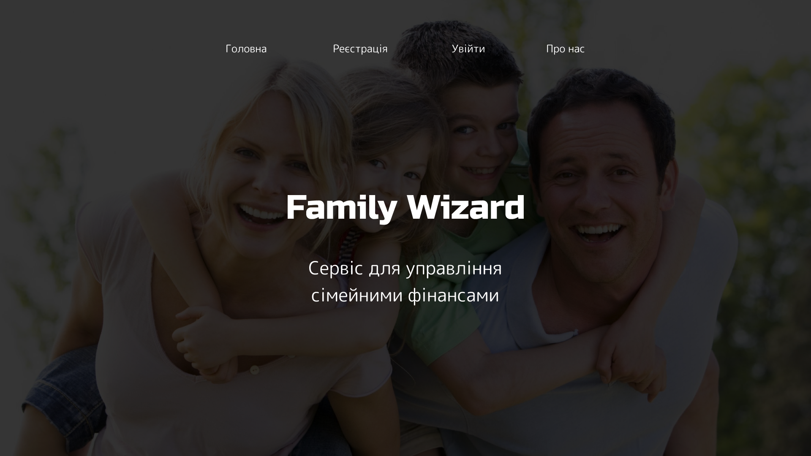
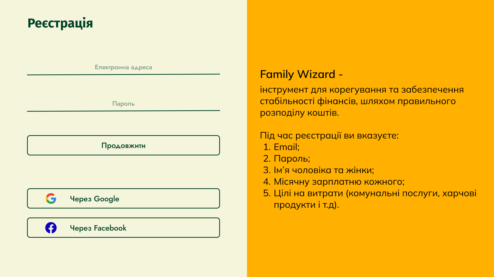
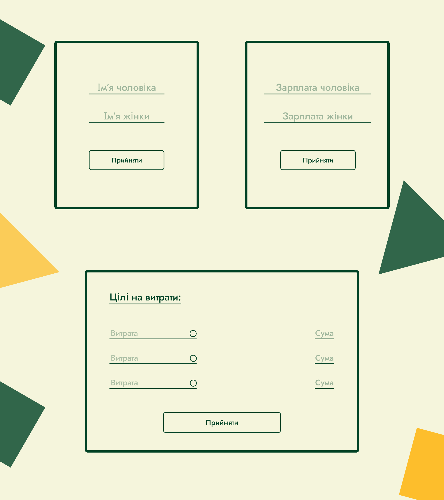
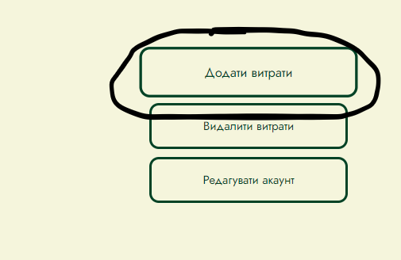
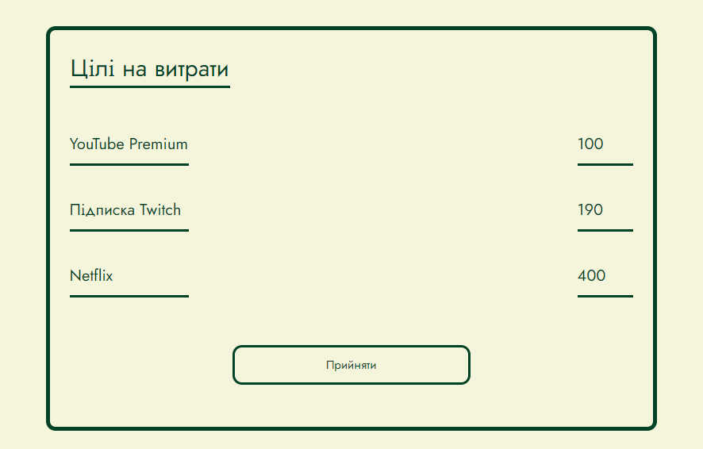
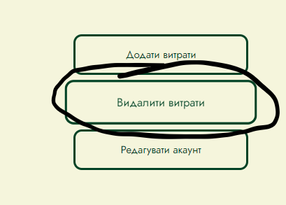
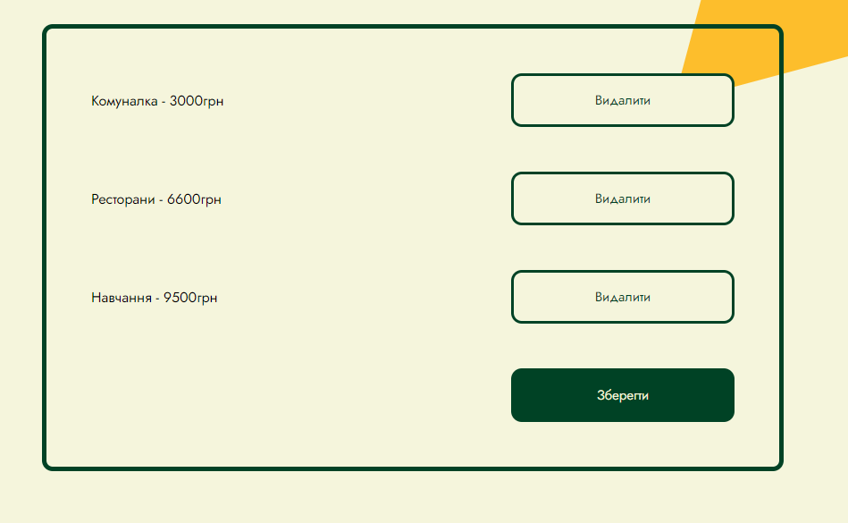
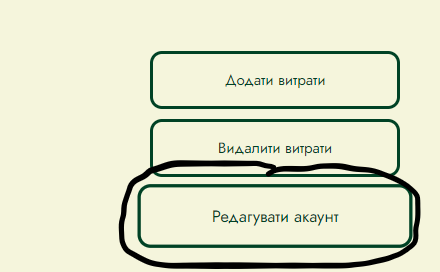
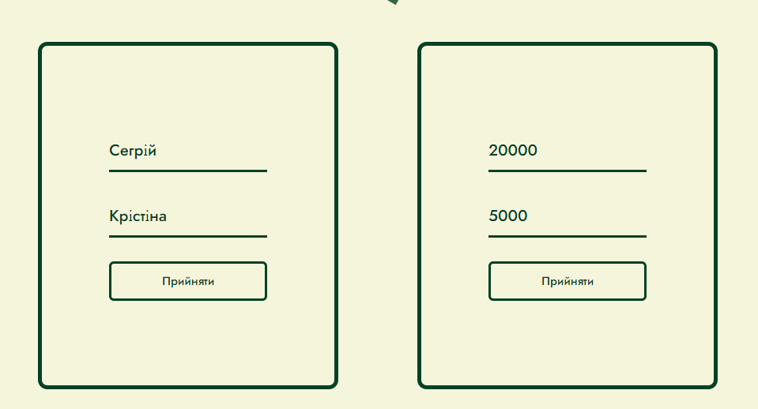

# **FAMILY WIZARD**
Спонсори - 

Технології -   
## **Що це?**
**Family Wizard** - це сайт який позбавляє вас записування витрат у блокнот чи запам'ятовувати скільки ви витратили на ресторани,комуналку,розваги та інше.
### Якщо коротко то **Family Wizard** це -
+ Карманний бугалтер - який підраховує ваши витрати
+ Зручно - у користуванні 
+ Сучасно - ні блокнотам, вперед технології!
## **Як цим користуватися?**
Для того щоб користуватися Family Wizard, треба

### 1.Треба зайти на **Головну сторінку**

### 2.Треба **Зареєструватися**

### 3.Після того, як ви зареєструвалися, треба ввести 
+ Імя Чоловіка
+ Імя Жінки
+ Їхні заплати

**Все** тепер ви можете користуватися Family Wizard!

## **Що робити якщо забув додати/додав зайвого/помилився у зарплатні чи імені?**

### **Забув додати витрату**
Якщо ви забули додати якусь витрату, то зайдіть на свій профіль та натисніть на кнопку **Додати витрати**

Потім записуєте витрати, які ви забули додати або вони з'явились нещодавно

Та натискаємо на **Підтвердити**

### **Випадково додав зайву витрату**

Якщо ви випадково додали зайву витрату або витрата згоріла, то натисніть на кнопку **Видалити витрати**

Після того, як ми натиснули на кнопку треба знайти витрату яку ми хочемо видалити та натискаємо на **Видалити**

Натискаємо **Зберегти**

### **Помилився у зарплатні або імені**

Якщо ви помилилися у заплатні чи імені, то натисніть на кнопку **Редагувати аккаунт**

Після того, як ми редагували ім'я або заплатню, ми натискаємо **Зберегти Ім'я/Заплатню**

